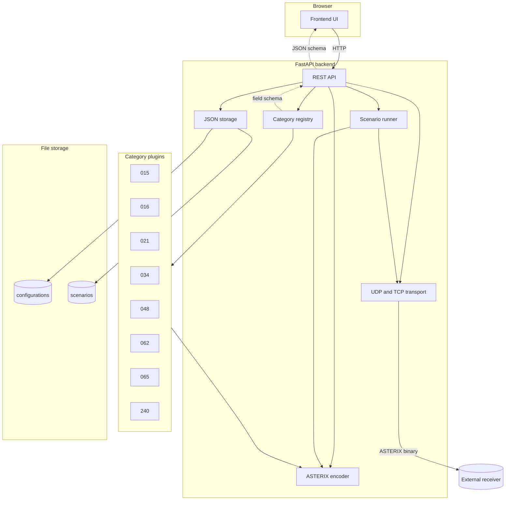
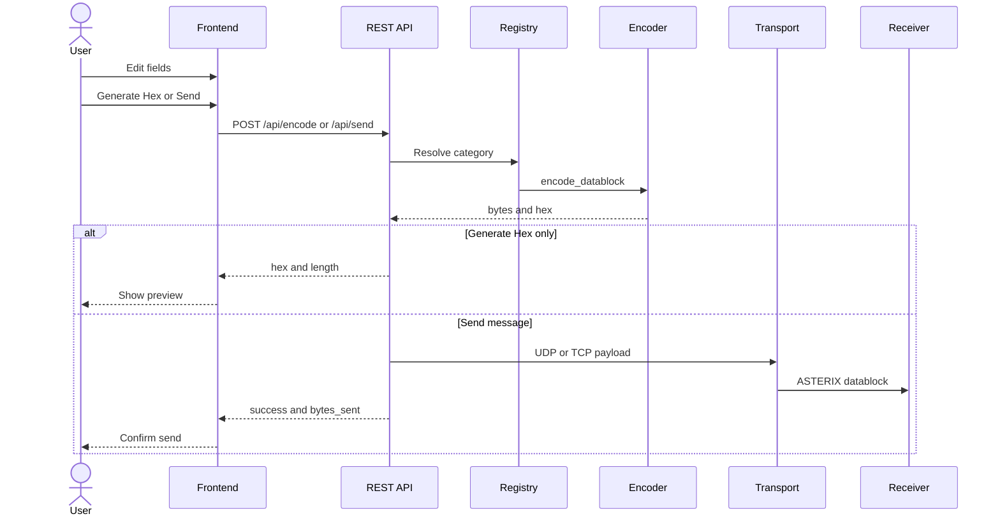

# Architecture

Obelix is a web-based tool for creating, editing and sending ASTERIX messages. It consists of a FastAPI backend, a static browser frontend, and JSON file storage for templates and scenarios.

## Architecture diagram



### Request flow (encode and send)



## Project structure

```
obelix/
├── backend/
│   ├── app/
│   │   ├── main.py                 # FastAPI application entry point
│   │   ├── api/                    # REST API route handlers
│   │   ├── asterix/                # ASTERIX encoding framework
│   │   │   ├── base.py             # Field schema, FSPEC builder, base encoder
│   │   │   ├── registry.py         # Category registry (plugin pattern)
│   │   │   └── categories/         # One module per ASTERIX category
│   │   ├── core/                   # Config, scenario runner, file storage
│   │   ├── models/                 # Pydantic request/response models
│   │   └── transport/              # UDP/TCP sending
│   └── tests/
├── frontend/                       # Static HTML/CSS/JS UI
│   ├── index.html
│   ├── css/style.css
│   └── js/app.js
└── data/                           # Saved templates and scenarios (JSON)
    ├── templates/
    └── scenarios/
```

## Design decisions

1. **Category plugin pattern** – Each ASTERIX category is a class implementing `definition()` (field schema for the UI) and `encode_record()` (binary encoding). Register new categories in `registry.py`.

2. **Schema-driven UI** – The frontend builds forms dynamically from the category field definitions returned by the API. No frontend changes needed when adding a category.

3. **Separation of concerns** – Encoding (`asterix/`), transport (`transport/`), orchestration (`scenario_runner.py`), and persistence (`storage.py`) are independent modules.

4. **Async scenario runner** – Scenarios run as background asyncio tasks with pause/stop via events, supporting configurable delays, repetition, and looping.

## Supported categories

| Category | Name | Edition |
|----------|------|---------|
| 015 | INCS Target Reports | 1.1 |
| 016 | INCS Configuration Reports | 1.0 |
| 021 | ADS-B Reports | 2.7 |
| 034 | Monoradar Service Messages | 1.29 |
| 048 | Monoradar Target Reports | 1.32 |
| 062 | System Track Data | 1.21 |
| 065 | SDPS Service Status | 1.5 |
| 240 | Radar Video Transmission | 1.3 |
