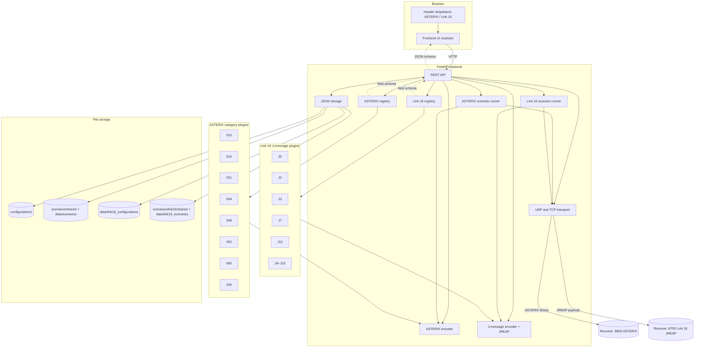
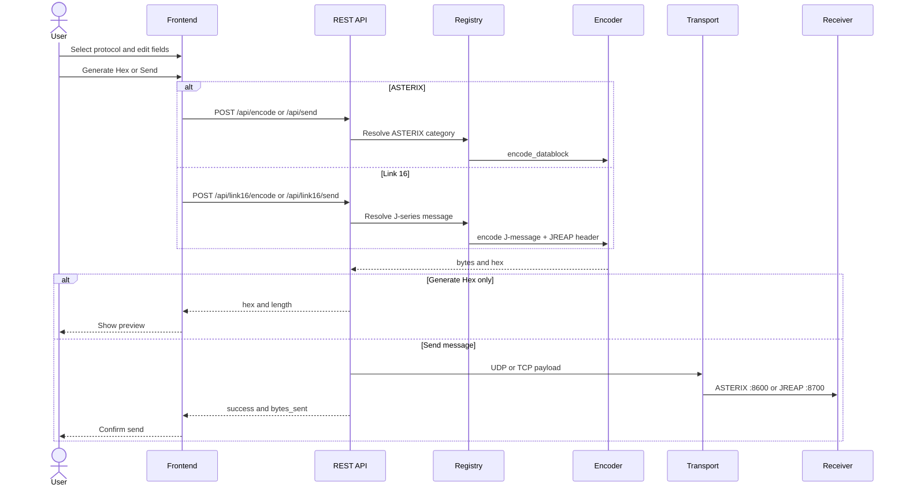

# Architecture

Obelix is a web-based tool for creating, editing and sending **ASTERIX** and **Link 16** messages. It consists of a FastAPI backend, a static browser frontend with dropdown navigation, and JSON file storage for configurations and scenarios.

## Architecture diagram



### Request flow (encode and send)



## Project structure

```
obelix/
├── backend/
│   ├── app/
│   │   ├── main.py                      # FastAPI application entry point
│   │   ├── api/                         # REST route handlers
│   │   │   ├── categories.py            # ASTERIX categories
│   │   │   ├── encode.py, send.py       # ASTERIX encode/send
│   │   │   ├── scenarios.py             # ASTERIX scenario runner API
│   │   │   └── link16.py                # Link 16 messages, encode, send, scenarios
│   │   ├── asterix/                     # ASTERIX encoding framework
│   │   │   ├── base.py                  # Field schema, FSPEC builder
│   │   │   ├── registry.py              # Category plugin registry
│   │   │   └── categories/              # One module per ASTERIX category
│   │   ├── link16/                      # Link 16 encoding framework
│   │   │   ├── base.py, jreap.py        # J-message base + JREAP wrapper
│   │   │   ├── registry.py              # J-series plugin registry
│   │   │   └── messages/                # J0, J2, J3, J7, J12, … encoders
│   │   ├── core/                        # Config, runners, file storage
│   │   │   ├── scenario_runner.py       # ASTERIX scenario orchestration
│   │   │   ├── link16_scenario_runner.py
│   │   │   ├── storage.py               # ASTERIX scenarios/configurations
│   │   │   └── link16_*_storage.py      # Link 16 persistence
│   │   ├── models/                      # Pydantic request/response models
│   │   ├── scenarios/                   # Built-in ASTERIX template builders
│   │   └── transport/                   # Shared UDP/TCP sending
│   └── tests/
│       ├── unit/                        # Encoding and registry (no I/O)
│       ├── integration/                 # In-process and live API tests
│       ├── regression/                  # Live HTTP regression (httpx)
│       └── frontend/                    # Playwright UI regression
├── frontend/                            # Static HTML/CSS/JS UI
│   ├── index.html
│   ├── css/style.css
│   └── js/
│       ├── navigation.js                # Header dropdown navigation
│       ├── app.js                       # ASTERIX editor and scenarios
│       ├── link16.js                    # Link 16 editor and scenarios
│       └── scenario-io.js               # Shared JSON export/import helpers
├── configurations/                      # Git-tracked ASTERIX presets
├── scenarios/
│   ├── shared/                          # Git-tracked ASTERIX scenarios
│   └── link16/shared/                   # Git-tracked Link 16 scenarios
└── data/                                # Local runtime data (gitignored)
    ├── configurations/
    ├── scenarios/
    ├── link16_configurations/
    └── link16_scenarios/
```

## Design decisions

1. **Parallel plugin registries** – ASTERIX categories and Link 16 J-series messages each implement `definition()` (field schema for the UI) and encoding logic. Register new plugins in the respective `registry.py`.

2. **Schema-driven UI** – The frontend builds forms dynamically from API field definitions. Adding a category or J-message does not require frontend form changes.

3. **Shared transport, separate payloads** – UDP/TCP sending is protocol-agnostic. ASTERIX uses port **8600** by default; Link 16 JREAP uses port **8700**.

4. **Independent scenario runners** – ASTERIX scenarios support route animation (motion); Link 16 scenarios send J-message steps with per-step **Source JU** for multi-node simulation. Both support delays, repeats, and loops.

5. **JSON-first scenarios** – Scenarios are JSON files on disk. The UI supports export/import for external editing (VS Code, git). Shared libraries live under `scenarios/shared/` and `scenarios/link16/shared/`.

6. **Separation of concerns** – Encoding (`asterix/`, `link16/`), transport (`transport/`), orchestration (`*_scenario_runner.py`), and persistence (`*_storage.py`) are independent modules.

## Frontend navigation

The UI uses two header **dropdown menus**:

| Dropdown | Views |
|----------|-------|
| **ASTERIX** | Message Editor · Scenario Builder · Configurations & Scenarios |
| **Link 16** | Message Editor · Scenario Builder · Configurations & Scenarios |

Each view maps to a panel section in `index.html`. Navigation state is managed by `navigation.js`; protocol-specific logic lives in `app.js` (ASTERIX) and `link16.js` (Link 16).

## Supported ASTERIX categories

| Category | Name | Edition |
|----------|------|---------|
| 015 | INCS Target Reports | 1.1 |
| 016 | INCS Configuration Reports | 1.0 |
| 021 | ADS-B Reports | 2.7 |
| 034 | Monoradar Service Messages | 1.29 |
| 048 | Monoradar Target Reports | 1.32 |
| 062 | System Track Data | 1.21 |
| 065 | SDPS Service Status | 1.5 |
| 240 | Radar Video Transmission | 1.3 |

## Supported Link 16 families

| Family | Role | Default port |
|--------|------|--------------|
| J0 | Network management | NPG 0 |
| J2 | PPLI (participant location) | NPG 1 |
| J3 | Track reports (air, surface, …) | NPG 2 |
| J7 | Track management / IFF | NPG 3 |
| J9–J15 | EW, mission, weather, simulation | NPG 5–10 |

38 J-series encoders in total. See [Link 16 reference](link16/README.md).

## Testing

Tests live under `backend/tests/` and follow a layered layout (builders → actions → assertions):

| Layer | Command | Requires server |
|-------|---------|-----------------|
| Unit | `./scripts/test.sh unit` | No |
| Integration | `./scripts/test.sh integration` | No (TestClient) |
| Regression | `./scripts/test.sh regression` | Yes |
| Frontend (Playwright) | `./scripts/test.sh frontend` | Yes |

See [backend/tests/README.md](../backend/tests/README.md) for the full guide.
