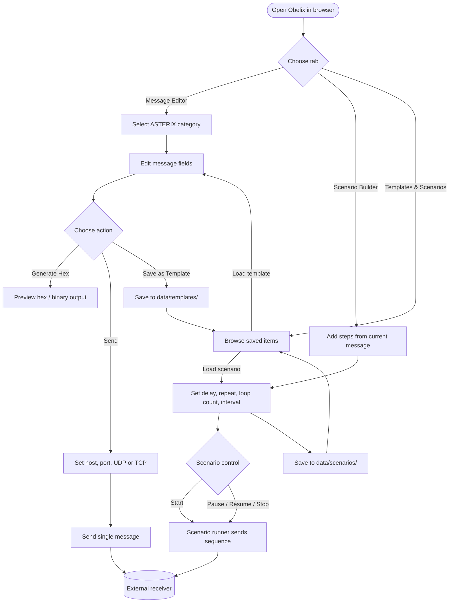
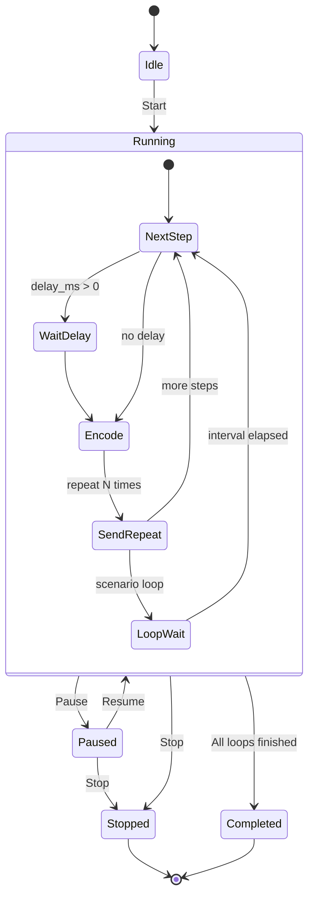

# Usage

## Usage diagram



### Scenario execution flow



## Message editor

1. Select an ASTERIX category from the sidebar.
2. Edit field values in the form.
3. Click **Generate Hex** to preview the encoded binary data.
4. Configure host/port and click **Send via UDP** (or TCP).

## Scenario builder

1. Configure messages in the Message Editor tab.
2. Switch to **Scenario Builder** and click **Add Step from Current Message**.
3. Set delays, repeats, loop count and interval.
4. For moving tracks (Cat 062, 048, 034): enable **Animate route** on a step, set the end waypoint, **Ticks** (number of updates), and **Interval (ms)** between updates.
5. Click **Start** to run; use **Pause**, **Resume**, and **Stop** to control execution.

### Route animation

When **Send multiple messages** is enabled on a step, Obelix sends several messages with changing position:

| Mode | Use when |
|------|----------|
| **Direction from start** | You only have a start point — set heading (0=N, 90=E), distance per message, count and interval |
| **Route to endpoint** | You know start and end — Obelix interpolates between them |

| Category | Animated fields |
|----------|-------------------|
| **062** | WGS-84 lat/lon or Cartesian X/Y; optional time and derived velocity |
| **015** | WGS-84 or range/azimuth (INCS target reports) |
| **048** | Range (RHO) and azimuth (THETA) |
| **034** | Antenna azimuth (sector crossing) |

**Without motion:** set **Repeat** on the step to send the same message multiple times.

**Change a step later:** edit the message in Message Editor, then click **Update from Editor** on the step.

**Add another message type:** configure a new message and click **+ Add Step from Current Message** again.

## Templates and scenarios

Save message configurations from the UI:

| Button | Location | Git |
|--------|----------|-----|
| **Save locally** | `data/configurations/catXXX/` | Ignored (private) |
| **Save to repository** | `configurations/catXXX/` | Commit when ready |

Load from the **Configurations & Scenarios** tab. See [configurations/README.md](../configurations/README.md) for git workflow.

Scenarios are stored under `data/scenarios/` (local) or `scenarios/shared/` (repository).

### Built-in Baltic exercise templates

The **Scenario Builder** tab includes three realistic templates that exercise **all implemented categories** (015, 016, 034, 048, 062):

| Template | Description |
|----------|-------------|
| **JAS 39 – Bromma → Visby** | Friendly Gripen transit with INCS config, monoradar service, plots, INCS target report, and SDPS system track |
| **Hostile MiG – Kaliningrad → Visby** | Non-cooperative track approaching Visby from Kaliningrad |
| **Baltic exercise – JAS + MiG combined** | Interleaved friendly and hostile traffic |

1. Open **Scenario Builder** → **Scenario templates & editor**.
2. Click **Load template** on a card (or adjust parameters and **Rebuild from parameters**).
3. Edit individual steps, transport, and timing as needed.
4. **Save Scenario** (local) or **Save to repository** to commit a variant under `scenarios/shared/`.

API: `GET /api/scenario-templates`, `POST /api/scenario-templates/{id}/build` with custom track numbers, Mode 3/A, flight levels, ticks, and interval.

See [scenarios/README.md](../scenarios/README.md) for regenerating shared JSON from Python.

### Export / import JSON files

Scenarios are JSON files on disk (`data/scenarios/` locally, `scenarios/shared/` in git). From **Scenario Builder**:

| Action | Result |
|--------|--------|
| **Download .json file** | Browser download — edit in VS Code or any editor |
| **Save locally & download** | Writes `data/scenarios/{id}.json` and downloads a copy |
| **Save locally** | Writes to `data/scenarios/` only |
| **Import .json file** | Load an edited file into the builder (validated) |
| **Apply JSON** | Load from the inline JSON editor |

From **Configurations & Scenarios**, use **Export** on a saved scenario or **Import .json file**.

API download: `GET /api/saved-scenarios/{id}/file` returns the same JSON as on disk.

**Typical workflow:** Download → edit `{id}.json` externally → Import .json → Run (or save back to `data/scenarios/`).

## Testing a UDP receiver

When running with `./obelix start --tools`, a UDP listener is started automatically on port 8600.

For decoding ASTERIX in Wireshark (install, capture filters, edition settings), see [Wireshark & ASTERIX](wireshark-asterix.md).

**Docker use case:** step-by-step capture of container traffic → [Wireshark + Docker use case](wireshark-docker-usecase.md).

To listen manually without Docker:

```bash
python -c "
import socket
s = socket.socket(socket.AF_INET, socket.SOCK_DGRAM)
s.bind(('0.0.0.0', 8600))
print('Listening on UDP 8600...')
while True:
    data, addr = s.recvfrom(4096)
    print(f'{addr}: {data.hex().upper()}')
"
```
