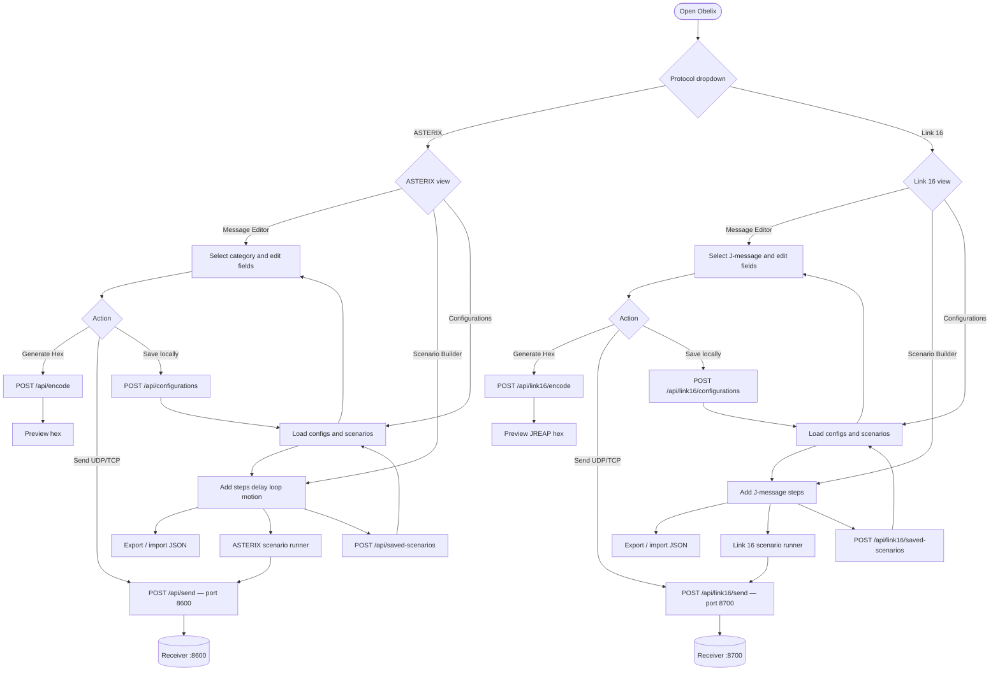
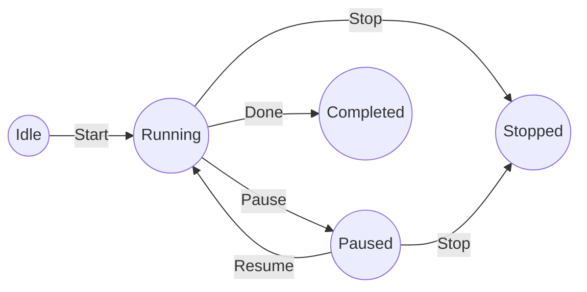
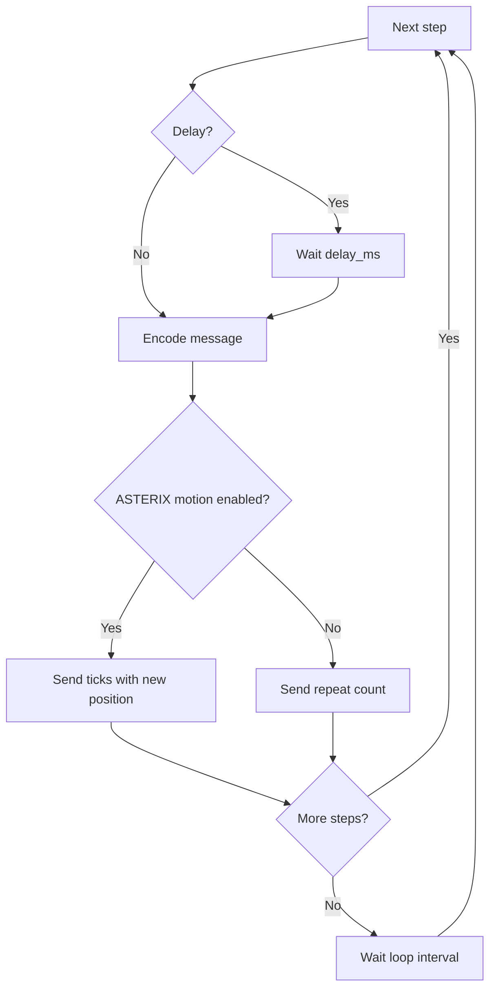

# Usage

> **New to Obelix?** Follow the [guided course](course/README.md) — a step-by-step tour with screenshots of the web UI and Swagger API.

## Usage diagram



### Scenario execution flow





> **Note:** Route animation (motion) applies to ASTERIX categories 015, 021, 034, 048, 062, and 240 only. Link 16 scenarios send one J-message per step (use different **Source JU** values to simulate multiple C2 nodes).

## Message editor

Use **ASTERIX → Message Editor** or **Link 16 → Message Editor** from the header dropdowns.

### ASTERIX

1. Select a category from the sidebar.
2. Edit field values in the form.
3. Click **Generate Hex** to preview the encoded binary data.
4. Configure host/port and click **Send via UDP** (or TCP) — default port **8600**.

### REST API (FastAPI / Swagger)

Open `/docs` for interactive API documentation. Besides the generic `POST /api/send`, each implemented category has its own endpoint with a typed field schema and a ready-to-use **Example Value** in Swagger:

| Category | Endpoint |
|----------|----------|
| 015 | `POST /api/send/15` |
| 016 | `POST /api/send/16` |
| 021 | `POST /api/send/21` |
| 034 | `POST /api/send/34` |
| 048 | `POST /api/send/48` |
| 062 | `POST /api/send/62` |
| 065 | `POST /api/send/65` |
| 240 | `POST /api/send/240` |

Request body shape:

```json
{
  "fields": { "...": "category-specific fields with defaults" },
  "host": "host.docker.internal",
  "port": 8600,
  "protocol": "udp"
}
```

Use `POST /api/send` when you need one endpoint for all categories (category is inside `message`).

## Link 16 (J-messages)

Use the header dropdown **Link 16 → Message Editor** to edit and send J-series messages the same way as ASTERIX categories. Default JREAP port is **8700**.

| Family | Examples |
|--------|----------|
| J2 | PPLI, Air PPLI |
| J3 | Air Track (J3.2), Surface Track |
| J7 | Track Management, IFF/SIF |
| J12 | Mission Assignment, Kinematic |

Set **Source JU** to simulate different C2 participants sending to the same gateway. API: `GET /api/link16/messages`, `POST /api/link16/encode`, `POST /api/link16/send/J3-2`. See [docs/link16/README.md](../link16/README.md).

### Link 16 scenario builder

1. **Link 16 → Message Editor** — configure a J-message and click **Add to Scenario →**.
2. **Link 16 → Scenario Builder** — review steps, set transport (port **8700**), loop count and interval.
3. **Start Scenario** to send steps in order (each step can use a different **Source JU**).

Pre-built exercises: [scenarios/link16/shared/](../scenarios/link16/shared/) (JAS transit, dogfight, marking run, C2 bilateral, C2 mesh). Load from **Link 16 → Configurations & Scenarios**.

### Link 16 export / import JSON

Same workflow as ASTERIX, in **Link 16 → Scenario Builder**:

| Action | Result |
|--------|--------|
| **Download .json file** | Browser download |
| **Save locally & download** | Writes `data/link16_scenarios/{id}.json` and downloads a copy |
| **Import .json file** / **Apply JSON** | Load and validate via `POST /api/link16/scenarios/validate` |

From **Link 16 → Configurations & Scenarios**, use **Export** on a saved scenario or **Import .json file**.

## Scenario builder

### ASTERIX

1. Configure messages in **ASTERIX → Message Editor**.
2. Switch to **ASTERIX → Scenario Builder** and click **Add Step from Current Message**.
3. Set delays, repeats, loop count and interval.
4. For moving tracks (Cat 015, 021, 034, 048, 062, 240): enable **Animate route** on a step, set the end waypoint, **Ticks** (number of updates), and **Interval (ms)** between updates.
5. Click **Start** to run; use **Pause**, **Resume**, and **Stop** to control execution.

### Route animation

When **Send multiple messages** is enabled on a step, Obelix sends several messages with changing position:

| Mode | Use when |
|------|----------|
| **Direction from start** | You only have a start point — set heading (0=N, 90=E), distance per message, count and interval |
| **Route to endpoint** | You know start and end — Obelix interpolates between them |

| Category | Animated fields |
|----------|-------------------|
| **015** | WGS-84 or range/azimuth (INCS target reports) |
| **021** | WGS-84 lat/lon; flight level and geometric height |
| **034** | Antenna azimuth (sector crossing) |
| **048** | Range (RHO) and azimuth (THETA) |
| **062** | WGS-84 lat/lon or Cartesian X/Y; optional time and derived velocity |
| **240** | Antenna azimuth (radar video / radial steps) |

Categories **016** and **065** are supported for encoding and scenarios but have **no route animation** — use **Repeat** to send the same message multiple times.

**Without motion:** set **Repeat** on the step to send the same message multiple times.

**Change a step later:** edit the message in Message Editor, then click **Update from Editor** on the step.

**Add another message type:** configure a new message and click **+ Add Step from Current Message** again.

## Templates and scenarios

Save message configurations from the UI:

| Button | Location | Git |
|--------|----------|-----|
| **Save locally** | `data/configurations/catXXX/` | Ignored (private) |
| **Save to repository** | `configurations/catXXX/` | Commit when ready |

Load from the **Configurations & Scenarios** tab. See [configurations/README.md](../configurations/README.md) for git workflow.

Scenarios are stored under `data/scenarios/` (local) or `scenarios/shared/` (repository).

### Built-in Baltic exercise templates

The **Scenario Builder** tab includes three realistic templates that exercise **all implemented categories** (015, 016, 021, 034, 048, 062, 065, 240):

| Template | Description |
|----------|-------------|
| **JAS 39 – Bromma → Visby** | Friendly Gripen transit with INCS config, monoradar service, plots, INCS target report, and SDPS system track |
| **Hostile MiG – Kaliningrad → Visby** | Non-cooperative track approaching Visby from Kaliningrad |
| **Baltic exercise – JAS + MiG combined** | Interleaved friendly and hostile traffic |

1. Open **Scenario Builder** → **Scenario templates & editor**.
2. Click **Load template** on a card (or adjust parameters and **Rebuild from parameters**).
3. Edit individual steps, transport, and timing as needed.
4. **Save Scenario** (local) or **Save to repository** to commit a variant under `scenarios/shared/`.

API: `GET /api/scenario-templates`, `POST /api/scenario-templates/{id}/build` with custom track numbers, Mode 3/A, flight levels, ticks, and interval.

See [scenarios/README.md](../scenarios/README.md) for regenerating shared JSON from Python.

### Export / import JSON files (ASTERIX)

Scenarios are JSON files on disk (`data/scenarios/` locally, `scenarios/shared/` in git). From **ASTERIX → Scenario Builder**:

| Action | Result |
|--------|--------|
| **Download .json file** | Browser download — edit in VS Code or any editor |
| **Save locally & download** | Writes `data/scenarios/{id}.json` and downloads a copy |
| **Save locally** | Writes to `data/scenarios/` only |
| **Import .json file** | Load an edited file into the builder (validated) |
| **Apply JSON** | Load from the inline JSON editor |

From **ASTERIX → Configurations & Scenarios**, use **Export** on a saved scenario or **Import .json file**.

API download: `GET /api/saved-scenarios/{id}/file` returns the same JSON as on disk.

**Typical workflow:** Download → edit `{id}.json` externally → Import .json → Run (or save back to `data/scenarios/`).

## Testing a UDP receiver

When running with `./obelix start --tools`, a UDP listener is started automatically on port 8600.

The UI uses header **dropdown menus** for **ASTERIX** and **Link 16**, each with **Message Editor**, **Scenario Builder**, and **Configurations & Scenarios**.

For decoding traffic in Wireshark:

| Protocol | Guide |
|----------|--------|
| Installation (all platforms) | [Wireshark installation](wireshark-install.md) |
| ASTERIX (port 8600) | [Wireshark & ASTERIX](wireshark-asterix.md) |
| Link 16 (port 8700) | [Wireshark & Link 16](wireshark-link16.md) |
| Docker + ASTERIX | [Wireshark + Docker use case](wireshark-docker-usecase.md) |

To listen manually without Docker:

```bash
python -c "
import socket
s = socket.socket(socket.AF_INET, socket.SOCK_DGRAM)
s.bind(('0.0.0.0', 8600))
print('Listening on UDP 8600...')
while True:
    data, addr = s.recvfrom(4096)
    print(f'{addr}: {data.hex().upper()}')
"
```
