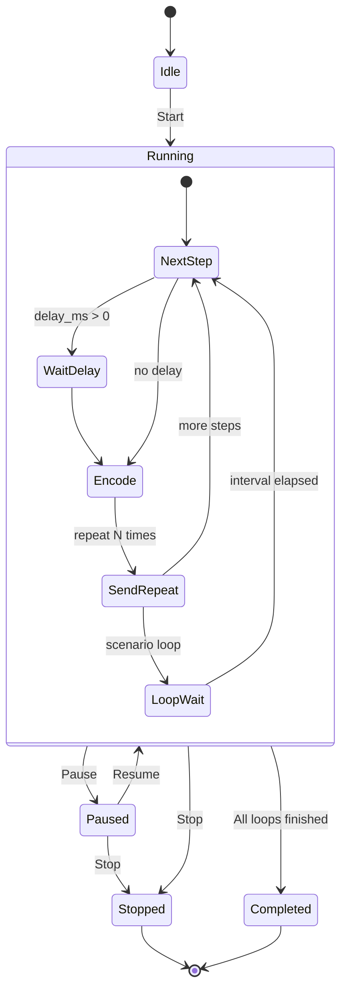

# Usage

## Usage diagram


### Scenario execution flow



## Message editor

1. Select an ASTERIX category from the sidebar.
2. Edit field values in the form.
3. Click **Generate Hex** to preview the encoded binary data.
4. Configure host/port and click **Send via UDP** (or TCP).

## Scenario builder

1. Configure messages in the Message Editor tab.
2. Switch to **Scenario Builder** and click **Add Step from Current Message**.
3. Set delays, repeats, loop count and interval.
4. Click **Start** to run; use **Pause**, **Resume**, and **Stop** to control execution.

## Templates and scenarios

Save message templates and scenarios from the UI. They are stored as JSON files under `data/templates/` and `data/scenarios/`.

## Testing a UDP receiver

When running with `./obelix start --tools`, a UDP listener is started automatically on port 8600.

For decoding ASTERIX in Wireshark (install, capture filters, edition settings), see [Wireshark & ASTERIX](wireshark-asterix.md).

**Docker use case:** step-by-step capture of container traffic → [Wireshark + Docker use case](wireshark-docker-usecase.md).

To listen manually without Docker:

```bash
python -c "
import socket
s = socket.socket(socket.AF_INET, socket.SOCK_DGRAM)
s.bind(('0.0.0.0', 8600))
print('Listening on UDP 8600...')
while True:
    data, addr = s.recvfrom(4096)
    print(f'{addr}: {data.hex().upper()}')
"
```
