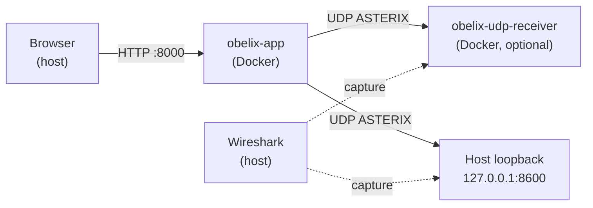

# Use case: Decode Obelix ASTERIX traffic from Docker with Wireshark

Step-by-step guide for capturing and decoding ASTERIX messages sent by Obelix running in Docker.

**Prerequisites:** Wireshark installed ([installation guide](wireshark-asterix.md)), Obelix running via `./obelix start --dev`.

---

## What you are capturing



When you click **Send via UDP** in the Obelix UI, the FastAPI backend inside `obelix-app` encodes the message and sends UDP from the **container network namespace** — not from your browser.

| Send target in UI | Where packets go | Best Wireshark interface |
|-------------------|------------------|---------------------------|
| `obelix-udp-receiver` | Docker network `obelix` | Docker bridge (e.g. `docker0`, `bridge100`) |
| `host.docker.internal` | Host port 8600 (published) | Loopback (`lo0` / `Loopback`) |
| `127.0.0.1` inside container | Container loopback only | **Not visible on host** — avoid this setup |

> **Important:** `127.0.0.1` in the Obelix UI means loopback **inside** `obelix-app`. Wireshark on the host will not see that traffic. Use one of the recommended targets below.

---

## Quick start (recommended setup)

### 1. Start Obelix with the UDP test receiver

```bash
./obelix start --dev --tools
```

This starts:

| Container | Role | Host port |
|-----------|------|-----------|
| `obelix-app` | Web UI + API + UDP sender | 8000 |
| `obelix-udp-receiver` | Prints received hex to logs | 8600/udp |

Verify:

```bash
./obelix status
docker ps --filter name=obelix
```

### 2. Configure ASTERIX editions in Wireshark

1. Open Wireshark → **Preferences → Protocols → ASTERIX**
2. Set editions to match Obelix:

| Category | Obelix edition |
|----------|----------------|
| 034 | 1.29 |
| 048 | 1.32 |
| 062 | 1.21 |

3. Click **OK**

### 3. Find the right network interface

**Option A — traffic to `obelix-udp-receiver` (recommended)**

List Docker network details:

```bash
docker network inspect obelix --format '{{range .Containers}}{{.Name}} {{.IPv4Address}}{{"\n"}}{{end}}'
```

In Wireshark, pick the interface that carries Docker bridge traffic:

| OS | Typical interface name |
|----|------------------------|
| macOS | `bridge100`, `utun`, or similar |
| Linux | `docker0` or `br-<network-id>` |
| Windows | `Ethernet` / `Npcap Loopback Adapter` — try the Docker NAT interface |

Tip: start a test send (step 5) and watch which interface counter increases.

**Option B — traffic to host via `host.docker.internal`**

Use the **loopback** interface (`lo0` on macOS, `Loopback` on Windows, `lo` on Linux).

### 4. Start capture in Wireshark

1. Select the interface from step 3
2. Set **Capture filter:** `udp port 8600`
3. Click **Start**

CLI alternative:

```bash
# Replace eth0/docker0/bridge100 with your interface
tshark -i docker0 -f "udp port 8600" -w obelix-docker.pcapng
```

### 5. Send a message from Obelix

1. Open [http://localhost:8000](http://localhost:8000)
2. Select a category (e.g. **Cat 62 – System Track Data**)
3. Click **Generate Hex** (optional preview)
4. Under **Transport**, set:

| Field | Value |
|-------|-------|
| Host | `obelix-udp-receiver` |
| Port | `8600` |
| Protocol | UDP |

5. Click **Send via UDP**

You should see a packet in Wireshark decoded as **ASTERIX**.

### 6. Verify decode

In the packet details pane, expand:

```text
User Datagram Protocol
  └─ ASTERIX packet, Category 062
       ├─ Category: 62
       ├─ Length: …
       └─ Asterix message, #01
            ├─ FSPEC
            ├─ 010, Data Source Identifier
            ├─ 070, Time Of Track Information
            └─ …
```

Apply display filter: `asterix && udp.port == 8600`

Confirm the receiver got the same data:

```bash
./obelix logs -f udp-receiver
```

---

## Alternative: send to the host loopback

Use this when the receiver runs on the host (not in Docker), or when you want to capture on loopback only.

### macOS / Windows

In Obelix **Transport**:

| Field | Value |
|-------|-------|
| Host | `host.docker.internal` |
| Port | `8600` |

Wireshark: capture on **Loopback**, filter `udp port 8600`.

### Linux

`host.docker.internal` is not always defined. Use the Docker bridge gateway (often `172.17.0.1`):

```bash
ip -4 addr show docker0 | grep inet
```

In Obelix UI set host to that IP (e.g. `172.17.0.1`), port `8600`.

Or add to `docker-compose.yml` under `app`:

```yaml
extra_hosts:
  - "host.docker.internal:host-gateway"
```

Then use `host.docker.internal` as on macOS.

---

## Scenario builder over Docker

1. Open **Scenario Builder** tab
2. Add steps from the message editor
3. Set scenario transport:

| Field | Value |
|-------|-------|
| Host | `obelix-udp-receiver` |
| Port | `8600` |

4. Start Wireshark capture **before** clicking **Start**
5. Run the scenario — multiple ASTERIX records appear in sequence

Display filter for one category only:

```text
asterix.category == 62 && udp.port == 8600
```

---

## Save and analyse captures

```bash
# Save from Wireshark: File → Save As → pcapng

# Or with tshark (10 packets)
tshark -i docker0 -f "udp port 8600" -c 10 -w obelix-cat062.pcapng

# Decode offline
tshark -r obelix-cat062.pcapng -Y asterix -V
```

Share `.pcapng` files with colleagues — they do not need Obelix running to analyse them in Wireshark.

---

## Troubleshooting

### No packets in Wireshark

| Check | Action |
|-------|--------|
| Wrong host in UI | Use `obelix-udp-receiver`, not `127.0.0.1` |
| Wrong interface | Try `docker0` / `bridge100` or loopback depending on target |
| Receiver not running | `./obelix start --dev --tools` |
| Port mismatch | Default is `8600`; match `OBELIX_UDP_PORT` if changed |

### UDP arrives but no ASTERIX decode

| Check | Action |
|-------|--------|
| Wireshark version | Use 3.x or 4.x |
| Edition mismatch | **Preferences → Protocols → ASTERIX** — set correct edition |
| Empty / invalid payload | Compare hex in Obelix UI with packet bytes in Wireshark |

### Compare Obelix hex with Wireshark

1. Obelix UI → **Generate Hex** → copy hex string
2. Wireshark → select UDP packet → **Packet Bytes** pane
3. Values should match (ignoring UDP/IP headers)

Example Cat 034 north marker: `220007C0010102`

### Capture permissions

See [Wireshark install guide — Troubleshooting](wireshark-asterix.md#troubleshooting).

### Debug inside the container

See raw traffic from the app container:

```bash
# Requires tcpdump in container (not installed by default)
docker exec obelix-app python -c "
import socket
print('Sending test from container...')
"

# Easier: rely on udp-receiver logs
./obelix logs -f udp-receiver
```

---

## Cheat sheet

```bash
# Start stack
./obelix start --dev --tools

# Obelix UI transport
#   Host: obelix-udp-receiver
#   Port: 8600

# Wireshark capture filter
udp port 8600

# Wireshark display filters
asterix
asterix.category == 62
asterix.category == 34
udp.port == 8600 && asterix

# Receiver logs
./obelix logs -f udp-receiver

# Stop
./obelix stop
```

---

## Related docs

- [Wireshark installation (macOS, Ubuntu, Red Hat, Windows)](wireshark-asterix.md)
- [Obelix setup with Docker](setup.md)
- [Obelix usage](usage.md)
